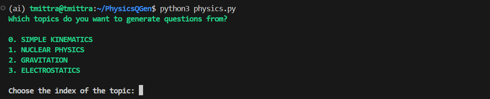

# Physics Word Problem Generation

Generate high-quality, diverse physics word problems using LLMs and agentic Retrieval-Augmented Generation (RAG) with Qdrant vector database.

## Folder Structure

- **DATASET**: Saved physics questions by topic.
- **ENTITY**: Topic entities with words and properties.
- **FINE_TUNE_GPT2**: GPT-2 finetuning code.
- **LLM**: RAG chains for question generation.
- **LLM_CONFIG**: LLM selection/configuration.
    - `BUILD_DATASET`: Save generated questions if true.
    - `OPENAI_API_KEY`: OpenAI API key.
    - `INNER_MODEL`: OpenAI model name.
- **NOVELTY_SCORE**: Novelty score calculation.
- **TOPICS**: Topic equations.
- **UTILS**: Utility functions.

## Agentic RAG with Qdrant

This project uses an agentic RAG pipeline to iteratively retrieve and refine context chunks from a Qdrant vector database. The agent interacts with Qdrant, evaluates chunk relevance, and improves retrieval over multiple steps to maximize question quality and topic coverage.

- **Qdrant**: Stores vectorized textbook and question bank chunks.
- **Agentic RAG**: The agent queries Qdrant, analyzes retrieved chunks, and adapts its strategy to get better context for question generation.
- **Iterative Retrieval**: Each round, the agent refines its queries and chunk selection, leading to more accurate and novel physics questions.

## How to Run

`physics.py` is the main entry point.

```bash
python physics.py --trials <num_questions>
```

See all options below:


## Citation

If you use this codebase, please cite or acknowledge appropriately.

---

For questions or suggestions, open an issue or contact the maintainer.
